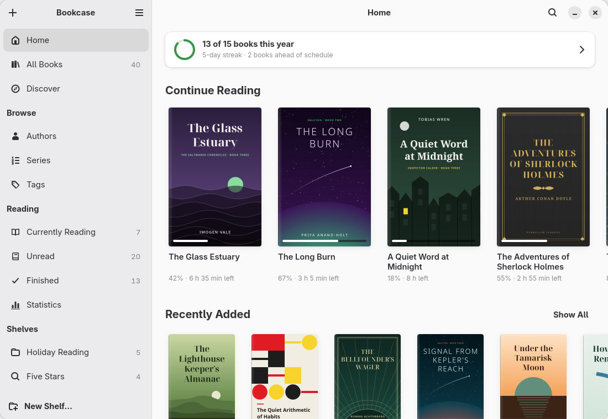
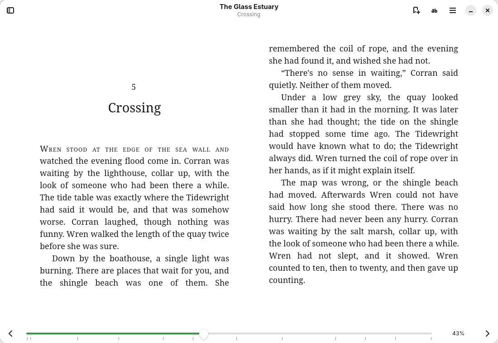
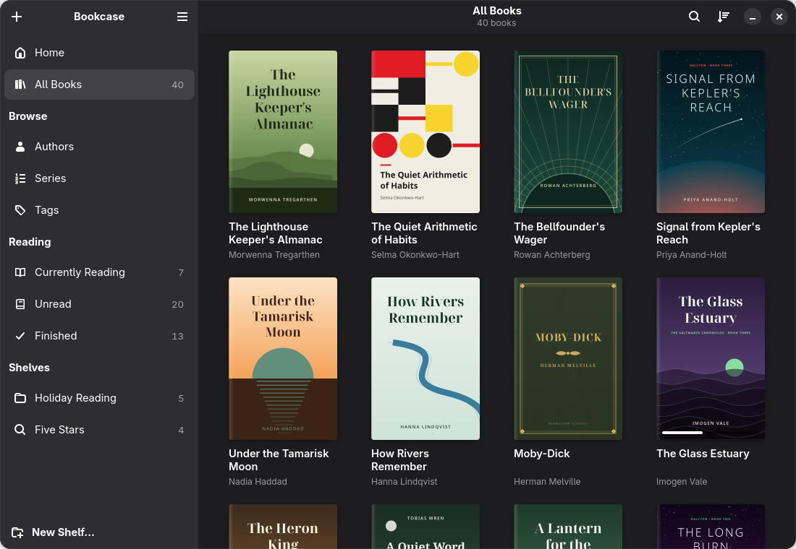
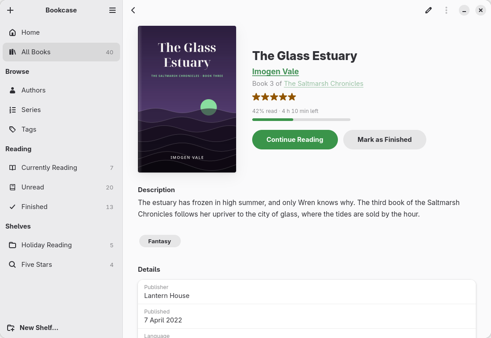
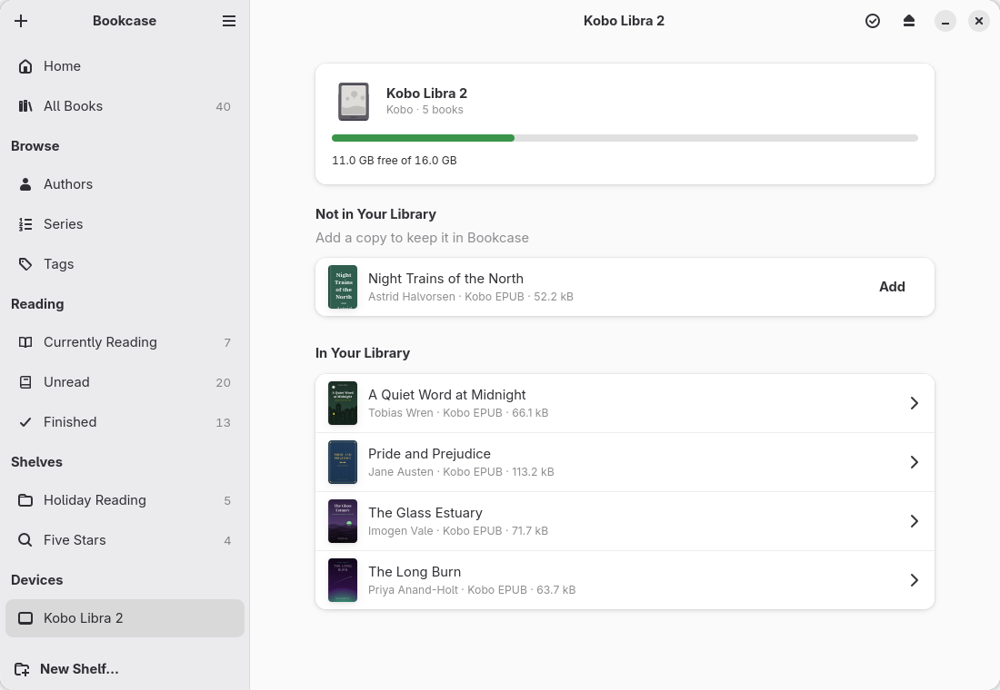
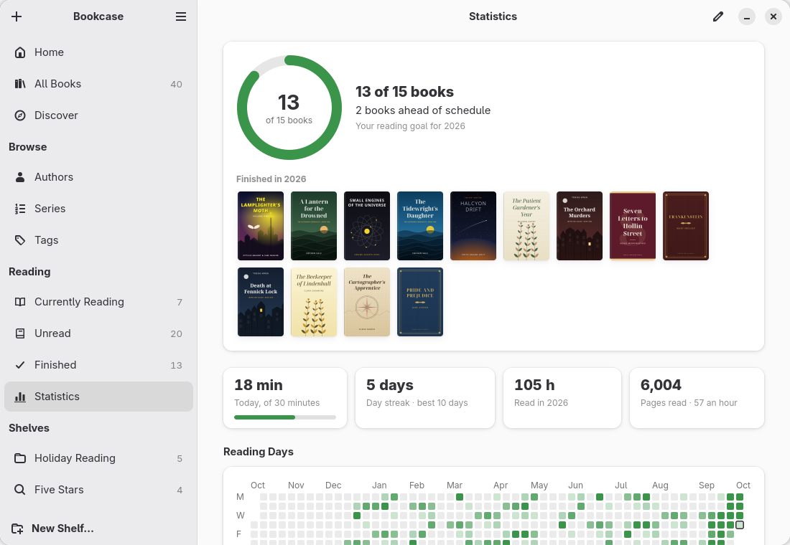

<div align="center">


# Bookcase

**Keep your e-books in order and read them.**

A native GNOME e-book library and reader. It shows your books as a shelf of covers, sorted
into authors, series and genres, reads them in a window of their own, and leaves your files
where you keep them.



</div>

## What it does

- **A library of covers,** with authors, series in order, tags, and the books you are
  reading, have not started, or have finished, a click away in the sidebar. Filter by
  format, status, rating and language; Ctrl+K goes to any book, author, series or shelf.
- **A first run that finds your books:** an existing Calibre library, a folder of books,
  the e-books in Downloads, each offered with one click.
- **Open a file without adding it:** a book opened from Files is read where it is, with Add
  to Library a click away.
- **Duplicates found and merged,** files, highlights, progress and shelves kept, with Undo.
- **A reader** for EPUB, Kobo EPUB, MOBI, AZW3, FB2, plain text and CBZ and CBR comics:
  pages side by side when the window is wide, your choice of typeface, size, spacing and
  paper (light, sepia, dark, black), and a scrolled mode. It opens where you left off.
- **PDFs read in Bookcase,** not handed to another app: sharp pages, continuous scrolling or
  spreads, zoom and fit, the PDF's outline and links, search, selection, highlights and
  notes, and the dark papers as a night mode.
- **Highlights, notes and bookmarks,** in five colours, listed beside the book. Search the
  whole book, and jump back to where you were. Export them as Markdown, and import a
  Kindle's highlights from its `My Clippings.txt`.
- **Look Up and Read Aloud:** double-click a word for its definition (from your StarDict
  dictionaries offline, else Wiktionary) and Wikipedia's summary, right in the reader; have
  the book read to you, sentence by sentence, through speech-dispatcher.
- **Shelves** of your own, and **smart shelves** that fill themselves from a search
  (`tag:fantasy status:unread`).
- **Metadata by hand or from Open Library:** titles, authors, series and number, tags,
  publisher, date, language, rating, description and cover, for one book or many at once.
  Google Books too, with a key of your own. **Find Metadata for a whole selection,** gently
  (Open Library's rate limit kept), reviewed book by book and applied as one undoable step.
- **E-readers over USB:** a Kobo, a Kindle or any reader that shows a books folder appears
  in the sidebar. Send books to it (as Kobo EPUBs for a Kobo), see what is on it, add what
  is only on it.
- **Send to Kindle by e-mail:** EPUBs (with your edits) mailed to your Kindle's address
  through your own mail account, the password in your keyring. Works for every Kindle,
  including those that no longer connect as a drive.
- **Discover books in online catalogues (OPDS):** Project Gutenberg, ManyBooks and your
  own Calibre-Web, Kavita, Komga or Calibre server; download straight into the library.
- **Reading sync with KOReader:** your place follows you between Bookcase, a KOReader
  e-reader and apps like Readest, over KOReader's free sync server or your own; "Your Kobo
  is at 62% — Go There".
- **Calibre libraries read in place,** and folders of books watched for new arrivals.
- **Undo everything,** from an edit to a removed shelf.
- **How long is left,** in the chapter and the book, from how fast you read.
- **Reading goals and statistics:** a yearly goal of books (kindly told: "2 books ahead of
  schedule"), minutes a day, your streak, a year of reading days, hours per month, and the
  authors and tags you read most.

It fits right in: light and dark styles, your accent colour, and windows down to phone size.

<table>
  <tr>
    <td></td>
    <td></td>
  </tr>
  <tr>
    <td></td>
    <td></td>
  </tr>
  <tr>
    <td></td>
    <td></td>
  </tr>
</table>

The screenshots show an invented demo library (`scripts/demo_library.py`): the books, their
authors and their covers are made up, apart from five public-domain classics.

## Bookcase and Calibre

Bookcase does what most people keep Calibre for (a tidy library, metadata, covers, series,
sending books to an e-reader) without its toolbar of thirty buttons or its folder layout.
The two get along:

- **Link a Calibre library** (main menu → *Link a Calibre Library…*) and its books appear in
  Bookcase with Calibre's titles, authors, series, tags, ratings and covers. The files are
  read where they are. Bookcase opens `metadata.db` read-only and never writes to it, so
  Calibre keeps working exactly as before. When Calibre changes a book, Bookcase picks the
  change up the next time it reads the library: when Bookcase starts, or with *Read Again*
  in Preferences.
- **Edits stay in Bookcase.** Changing a linked book's title or cover changes Bookcase's
  record of it, not Calibre's. A copy you send to an e-reader or export carries the edits.
- Bookcase does not convert between formats. For a Kindle, an EPUB is converted with
  Calibre's `ebook-convert` when it is installed, or sent by e-mail, which Amazon converts.

## Your files are yours

Bookcase never moves, renames or rewrites a book file. Books you add are **copied** into
your library folder (`~/Books` by default) as `Author/Title.epub`, and the originals are left
alone. A watched folder or a Calibre library is read in place. Removing a book from the
library leaves its file; *Move to Trash* is a separate action, and asks first.

Bookcase's own data (the library database, covers and thumbnails) lives in
`~/.local/share/bookcase/`, not beside your books, so a books folder on a network drive or
in a synced folder is safe. Books are recognised by their content, not their path: a book
moved or renamed inside a watched folder is found again, and one that has gone missing
elsewhere can be pointed to with *Locate File…*.

## Getting it

It isn't on Flathub yet. To build and install it yourself you need Python 3.12, PyGObject
3.50, pycairo, GTK 4.20, libadwaita 1.9, WebKitGTK 6.0 (for the reader), python-lxml,
Meson 1.2 and `blueprint-compiler` 0.22 (Meson downloads its own when the installed one is
missing or older). Poppler's GObject bindings are optional: with them, PDFs get their covers
and details and open in the reader. `bsdtar` (libarchive) is needed to read CBR comics. Fedora 44, Ubuntu 26.04, Arch Linux and openSUSE Tumbleweed ship all of these.

```sh
git clone https://github.com/Jackicus/GNOME-Bookcase.git
cd GNOME-Bookcase
meson setup build --prefix=/usr
meson install -C build
```

On Arch, `build-aux/aur/PKGBUILD` builds a package. `build-aux/flatpak/` holds a manifest
for a development Flatpak (untested). For a look without installing,
`scripts/run.sh --demo` runs a development build on the invented library.

## Reading

| To | Key |
|---|---|
| Next page, previous page | <kbd>→</kbd> <kbd>←</kbd>, <kbd>Space</kbd> <kbd>Shift</kbd> <kbd>Space</kbd>, <kbd>Page Down</kbd> <kbd>Page Up</kbd>, <kbd>L</kbd> <kbd>H</kbd> |
| Next chapter, previous chapter | <kbd>]</kbd> <kbd>[</kbd> |
| Start, end of the book | <kbd>Home</kbd> <kbd>End</kbd> |
| Back to where you were | <kbd>Alt</kbd> <kbd>←</kbd> |
| Contents, highlights and search | <kbd>Ctrl</kbd> <kbd>T</kbd> |
| Search the book | <kbd>Ctrl</kbd> <kbd>F</kbd> or <kbd>/</kbd> |
| Bookmark this page | <kbd>Ctrl</kbd> <kbd>D</kbd> |
| Larger, smaller text | <kbd>Ctrl</kbd> <kbd>+</kbd> <kbd>Ctrl</kbd> <kbd>−</kbd> |
| Fullscreen | <kbd>F11</kbd> |

In the library, <kbd>Ctrl</kbd> <kbd>O</kbd> adds books, <kbd>Ctrl</kbd> <kbd>F</kbd>
searches, <kbd>Enter</kbd> reads the selected book and <kbd>Ctrl</kbd> <kbd>Z</kbd> undoes.
<kbd>Ctrl</kbd> <kbd>?</kbd> shows every shortcut.

## Privacy

Nothing leaves your computer unless you ask. Bookcase has no account of its own and no
telemetry. It goes online only when you press *Find Metadata* (it sends the book's title,
authors or ISBN to Open Library, and to Google Books if you gave it a key), when you send a
book to your Kindle by e-mail (through the mail server you set up), when you have signed in to a KOReader sync server (it
gets a fingerprint of the book's file, how far in you are and the computer's name), when you
open a link from a book, and when you look a word up (Wiktionary or Wikipedia, in your browser).
Books are shown with their own scripts switched off and the network closed to them.

## How it works

**The library is one SQLite file** (`library.sqlite`) holding books, their files, authors,
series, tags, shelves, highlights and reading sessions. Each book is keyed by a hash of its
content (KOReader's partial MD5), so duplicates are caught on import and moved files are
found again. Covers are kept as the image files they came as, with thumbnails beside them.

**The reader is a WebKit view running foliate-js,** the engine Foliate uses, vendored and
pinned in `src/reader/foliate/`. A small bridge (`src/reader/reader.js`) talks to the GTK
window around it; everything outside the page (contents, highlights, the typography popover,
the progress bar) is GTK and libadwaita. Positions are EPUB CFIs, saved as you read.

**Every change can be undone.** Edits, removals, shelves and highlights are recorded as undo
steps, so a mistake costs Ctrl+Z rather than a confirmation dialog.

In the code, the model (`library.py`, `search.py`, `formats/`, `importing.py`, `calibre.py`,
`covers.py`, `online.py`, `devices.py`, `kepub.py`) has no GTK in it and is tested without a
display; the window, pages and dialogs sit on top. `CLAUDE.md` has the full map.

## Contributing

`scripts/check.sh` runs the lint, the build and the tests; `CLAUDE.md` describes the code and
its rules, `docs/decisions.md` the choices and why, and `TODO.md` what is not done yet.
Translations go in `po/`. Bugs and ideas go in the
[issue tracker](https://github.com/Jackicus/GNOME-Bookcase/issues).

## Licence

GPL-2.0-or-later. The reader is built on [foliate-js](https://github.com/johnfactotum/foliate-js)
by John Factotum (MIT), which bundles zip.js (BSD-3-Clause) and fflate (MIT). Calibre, Kobo
and Kindle are trademarks of their owners; Bookcase is not affiliated with them.
